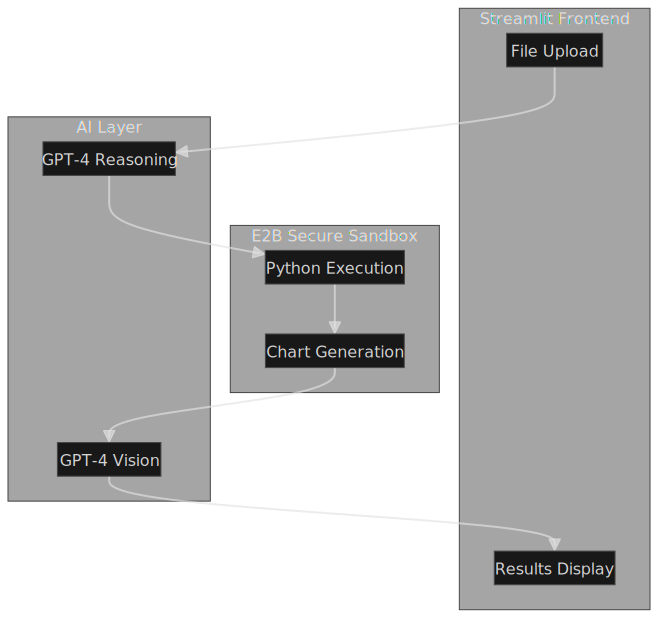

# 📈 Data-to-Insight AI Analyst

An intelligent AI-powered data analysis agent that automatically reads structured datasets (CSV/Excel), identifies key trends and anomalies, and generates actionable business insights with visual explanations.


---

## 🎬 Demo & Presentation

### 📹 Watch the Demo

| Resource | Description | Link |
|----------|-------------|------|
| **🎥 Loom Video** | Full walkthrough of the AI Data Analyst | [▶️ Watch on Loom](https://www.loom.com/share/f8beea7a15a94da2a611ad4199c6ee94) |
| **📺 Local Demo** | Three-Phase Analysis screencast | [Demo Video of the Three Phase Analysis.webm](./Demo%20Video%20of%20the%20Three%20Phase%20Analysis.webm) |
| **📊 Presentation** | 5-Slide Summary Deck | [Data_Analyst_Presentation_20251228_223319.pptx](./Data_Analyst_Presentation_20251228_223319.pptx) |

### 📄 Sample Outputs

See the `/Samples/` folder for PDF examples of each analysis mode:

| Sample | Analysis Mode |
|--------|---------------|
| [Basic Data Analysis.pdf](./Samples/Basic%20Data%20Analysis.pdf) | 📊 Basic trends, WoW changes, anomalies |
| [Deep Pattern Analysis.pdf](./Samples/Deep%20Pattern%20Analysis.pdf) | 🔬 Segment-level cross-dimensional insights |
| [TwoPhase Analysis Basic and Deep Pattern Analysis.pdf](./Samples/TwoPhase%20Analysis%20Basic%20and%20Deep%20Pattern%20Analysis.pdf) | 🔄 Combined Two-Phase Analysis (Recommended) |

---

## ✨ Features

### Core Analysis
- **📊 Automatic Data Analysis**: Upload CSV/Excel files and get instant insights
- **🔍 Smart Schema Detection**: Auto-detects date columns, numeric metrics, and categorical dimensions
- **📈 Trend Analysis**: Weekly aggregation, WoW changes, trend direction via linear regression
- **⚠️ Anomaly Detection**: Z-score and IsolationForest methods for outlier detection
- **🎯 Actionable Recommendations**: Business-oriented suggestions based on data patterns

### AI-Powered Features
- **🤖 Remote Sandbox Execution**: Runs analysis securely in E2B cloud sandbox
- **👁️ Vision LLM Analysis**: GPT-4 Vision analyzes generated charts and provides detailed explanations
- **💡 Deep Pattern Detection**: Identifies segment-level anomalies and cross-dimensional patterns
- **📝 Natural Language Insights**: Plain English explanations of complex data patterns

### Business Intelligence Output
- **📋 Executive Business Summary**: Cohesive 2-3 sentence narrative summarizing the overall data story
- **🎯 Prioritized Next Actions**: 2-3 actionable recommendations with:
  - Priority level (Urgent/High/Medium)
  - Specific action to take
  - Expected business impact
  - Responsible owner/team

### 💬 Interactive Chat with Your Data
- **Conversational AI**: Ask follow-up questions in natural language
- **Dynamic Visualizations**: Request custom charts on-the-fly
- **Session Memory**: Maintains conversation context across queries
- **Example Questions**: Pre-built prompts to get started quickly
- **Export Chat**: Download your analysis conversation

### Multiple Analysis Modes
| Mode | Description |
|------|-------------|
| 🔄 **Two-Phase Analysis** | Basic analysis + deep pattern detection (recommended) |
| 📊 **Basic Data Analysis** | Trends, WoW changes, anomaly detection |
| 🔬 **Deep Pattern Analysis** | Segment-level, cross-dimensional insights |

## 🚀 Quick Start

### Prerequisites
- Python 3.9+
- OpenAI API key (for AI features)
- E2B API key (for sandbox execution)

### Installation

1. **Clone the repository**
```bash
git clone https://github.com/dv0331/Ai-Data-Analyst.git
cd Ai-Data-Analyst
```

2. **Create virtual environment**
```bash
python -m venv .venv
.venv\Scripts\activate  # Windows
# or
source .venv/bin/activate  # macOS/Linux
```

3. **Install dependencies**
```bash
pip install -r requirements.txt
```

4. **Set environment variables**
```bash
# Create .env file
echo "OPENAI_API_KEY=your-openai-key" > .env
echo "E2B_API_KEY=your-e2b-key" >> .env
```

5. **Run the app**
```bash
streamlit run app.py
```

## 📁 Project Structure

```
Data Analyst Agent/
├── app.py                                    # Main Streamlit application
├── prompts.json                              # AI prompts configuration (3 modes)
├── Architecture.svg                          # System architecture diagram
├── requirements.txt                          # Python dependencies
├── README.md                                 # This file
│
├── 📹 Demo & Presentation/
│   ├── Demo Video of the Three Phase Analysis.webm   # Local demo video
│   └── Data_Analyst_Presentation_20251228_223319.pptx # 5-slide summary
│
├── 📄 Samples/                               # Sample PDF outputs
│   ├── Basic Data Analysis.pdf
│   ├── Deep Pattern Analysis.pdf
│   └── TwoPhase Analysis Basic and Deep Pattern Analysis.pdf
│
├── 📚 Documentation/
│   ├── DEMO_SCRIPT.md                        # Demo video script
│   ├── PROJECT_OVERVIEW.md                   # Detailed project overview
│   ├── QUICK_REFERENCE.md                    # Quick reference card
│   └── CREATE_PRESENTATION.vba              # VBA code for PPT generation
│
├── .streamlit/                               # Streamlit configuration
│   ├── config.toml
│   └── secrets.toml.example
│
└── lib/                                      # Core library modules
    ├── coding_agent.py                       # AI agent loop logic
    ├── tools.py                              # Tool implementations
    ├── tools_schemas.py                      # OpenAI function schemas
    └── ...
```

## 🎛️ Configuration

### Prompts
Edit `prompts.json` to customize agent behavior:

```json
{
  "data_analysis": { ... },    // Basic analysis prompt
  "deep_insights": { ... },    // Deep pattern detection prompt  
  "combined": { ... }          // Two-phase analysis (default)
}
```

### Analysis Settings
Adjust in the Streamlit sidebar:
- Time grain (Daily/Weekly/Monthly)
- Anomaly detection method (Z-score/IsolationForest)
- Z-score threshold
- IsolationForest contamination rate

## 📊 Sample Output

### Executive Business Summary
```
Overall business performance is strong with $4.1M total revenue and a healthy +3% WoW 
growth trend. Region A leads performance while Region B shows concerning -28% decline 
requiring immediate attention. The seasonal uptick in Q4 presents opportunity for 
targeted promotional activities.
```

### Key Insights Generated
```
✅ Total revenue: $4,103,231
✅ Latest WoW change: +3.01%
✅ Trend direction: Increasing (slope: +6,289/week)
✅ Anomaly detected: Week of Dec 15 (Region C -28%)
```

### Recommended Next Actions
The system generates prioritized, actionable recommendations:

| Priority | Action | Expected Impact | Owner |
|----------|--------|-----------------|-------|
| 🔴 URGENT | Investigate Region B's 28% revenue decline | Potential $50K recovery | Sales Team |
| 🟡 HIGH | Replicate Region A's campaign in underperforming regions | 15% lift in target regions | Marketing |
| 🟢 MEDIUM | Develop Q1 promotional calendar based on patterns | Better resource allocation | Planning |

### AI Chart Analysis
The Vision LLM provides detailed analysis of each chart:
- **Trend patterns** and seasonal cycles
- **Anomaly explanations** with business context
- **Segment comparisons** and performance gaps
- **Actionable recommendations** based on visual patterns

### 💬 Chat with Your Data Examples
```
User: "Which region performed best last quarter?"
AI: "Based on the analysis, Region A leads with $1.2M revenue and +15% WoW growth..."

User: "Show me a pie chart of revenue by category"
AI: [Generates and displays pie chart visualization]

User: "What actions should I prioritize this week?"
AI: "Based on the detected patterns, here are your priorities:
     1. 🔴 URGENT: Address Region B's 28% decline...
     2. 🟡 HIGH: Replicate Region A's campaign..."
```

## 🔧 API Keys Required

| Service | Purpose | Get Key |
|---------|---------|---------|
| OpenAI | GPT-4 for insights + Vision for chart analysis | [platform.openai.com](https://platform.openai.com) |
| E2B | Secure sandbox for code execution | [e2b.dev](https://e2b.dev) |

## 🏗️ Architecture



<details>
<summary>View Text-based Architecture</summary>

```
┌─────────────┐     ┌─────────────┐     ┌─────────────┐
│   Upload    │────▶│  E2B        │────▶│   OpenAI    │
│   Dataset   │     │  Sandbox    │     │   GPT-4     │
└─────────────┘     └─────────────┘     └─────────────┘
                           │                   │
                           ▼                   ▼
                    ┌─────────────┐     ┌─────────────┐
                    │   Charts    │────▶│   Vision    │
                    │   (PNG)     │     │   Analysis  │
                    └─────────────┘     └─────────────┘
                           │                   │
                           └───────────────────┘
                                    │
                                    ▼
                           ┌─────────────┐
                           │  Streamlit  │
                           │     UI      │
                           └─────────────┘
```
</details>

## 📝 Design Approach

1. **Ingest**: Load CSV/Excel file
2. **Infer Schema**: Detect date/metric/group columns
3. **Aggregate**: Weekly time series aggregation
4. **Analyze**: Trends, WoW changes, anomalies
5. **Detect Patterns**: Segment-level deep analysis
6. **Generate Insights**: Plain English findings
7. **Visualize**: Charts with AI explanations
8. **Recommend**: Actionable next steps

## 📦 Submission Package

This project includes all required deliverables:

| Deliverable | File/Link | Status |
|-------------|-----------|--------|
| **1. Working Demo** | [🎥 Loom Video](https://www.loom.com/share/f8beea7a15a94da2a611ad4199c6ee94) | ✅ Complete |
| **2. Local Demo Video** | [Demo Video of the Three Phase Analysis.webm](./Demo%20Video%20of%20the%20Three%20Phase%20Analysis.webm) | ✅ Complete |
| **3. 5-Slide Summary Deck** | [Data_Analyst_Presentation_20251228_223319.pptx](./Data_Analyst_Presentation_20251228_223319.pptx) | ✅ Complete |
| **4. README Documentation** | This file | ✅ Complete |
| **5. Sample Outputs** | [/Samples/](./Samples/) folder with 3 PDF examples | ✅ Complete |
| **6. GitHub Repository** | [github.com/dv0331/Ai-Data-Analyst](https://github.com/dv0331/Ai-Data-Analyst) | ✅ Complete |

---

## 🤝 Contributing

Contributions are welcome! Please feel free to submit a Pull Request.

## 📄 License

MIT License - feel free to use this for your own projects.

## 🙏 Acknowledgments

- Built with [Streamlit](https://streamlit.io/)
- Powered by [OpenAI GPT-4](https://openai.com/)
- Sandboxed by [E2B](https://e2b.dev/)

---

### 📧 Contact

For questions about this project, please refer to the [Loom Demo](https://www.loom.com/share/f8beea7a15a94da2a611ad4199c6ee94) or review the [presentation slides](./Data_Analyst_Presentation_20251228_223319.pptx).
